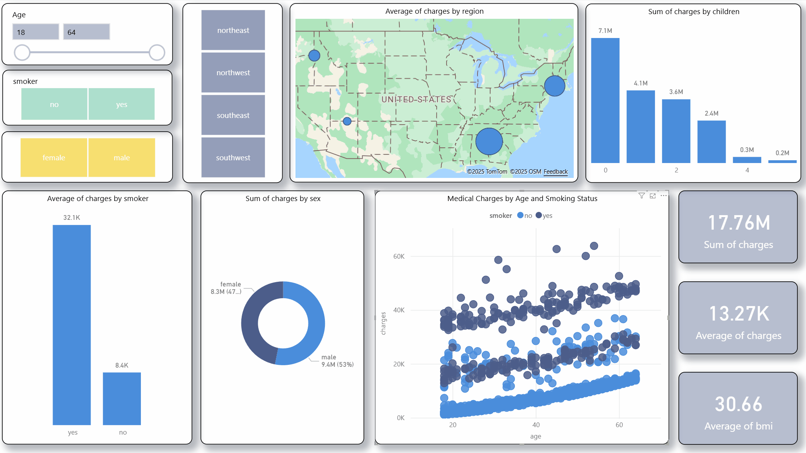

# Medical Insurance Analysis Report



## 📊 Project Overview

This project analyzes medical insurance costs using Power BI to provide insights into factors affecting insurance charges. The analysis explores relationships between demographic factors, lifestyle choices, and insurance premiums to help understand cost drivers in the healthcare insurance industry.

## 📁 Dataset Information

The analysis is based on a comprehensive medical insurance dataset (`insurance.csv`) containing **1,340 records** with the following attributes:

**Dataset Source**: [Medical Insurance Cost Dataset - Kaggle](https://www.kaggle.com/datasets/mosapabdelghany/medical-insurance-cost-dataset)

| Column | Description | Data Type |
|--------|-------------|-----------|
| `age` | Age of the policyholder | Numeric |
| `sex` | Gender of the policyholder (male/female) | Categorical |
| `bmi` | Body Mass Index | Numeric |
| `children` | Number of dependents | Numeric |
| `smoker` | Smoking status (yes/no) | Categorical |
| `region` | Geographic region (northeast, northwest, southeast, southwest) | Categorical |
| `charges` | Medical insurance charges (target variable) | Numeric |

## 🎯 Key Analysis Areas

- **Demographic Impact**: How age and gender affect insurance premiums
- **Health Factors**: Relationship between BMI and insurance costs
- **Lifestyle Analysis**: Impact of smoking on medical charges
- **Family Size**: Effect of number of children on insurance costs
- **Geographic Trends**: Regional variations in insurance charges
- **Cost Distribution**: Statistical analysis of charge patterns

## 📈 Key Insights

*Add your specific findings here based on your Power BI analysis*

## 🛠️ Tools Used

- **Power BI Desktop**: Data visualization and dashboard creation
- **Microsoft Excel**: Data preprocessing and validation
- **CSV Format**: Raw data storage and management

## 📋 Files Structure

```
MedInsuranceReport/
├── insurance.csv          # Raw dataset (1,340 records)
├── InsuranceReport.gif    # Dashboard preview/demo
├── InsuranceReport.pbix   # Power BI file
└── README.md              # Project documentation
```

## 🚀 Getting Started

### Prerequisites
- Power BI Desktop (latest version)
- Basic understanding of data analysis concepts

### How to Use

**Option 1: Use the Ready-Made Report**
1. Download the `InsuranceReport.pbix` file
2. Open Power BI Desktop
3. Open the PBIX file to view the complete analysis and dashboard
4. Explore the interactive visualizations and insights

**Option 2: Build from Scratch**
1. Download the `insurance.csv` file
2. Open Power BI Desktop
3. Import the CSV file using "Get Data" → "Text/CSV"
4. Follow the data transformation steps as needed
5. Create visualizations based on your analysis requirements

## 📊 Sample Data Preview

```csv
age,sex,bmi,children,smoker,region,charges
19,female,27.9,0,yes,southwest,16884.924
18,male,33.77,1,no,southeast,1725.5523
28,male,33,3,no,southeast,4449.462
```

## 🔍 Analysis Questions Explored

- What demographic factors most strongly correlate with insurance charges?
- How does smoking status impact insurance premiums?
- Are there significant regional differences in insurance costs?
- What is the relationship between BMI and medical charges?
- How do family size and age interact to affect insurance costs?

## 📊 Dashboard Features

*Describe the specific visualizations and features in your Power BI report*
