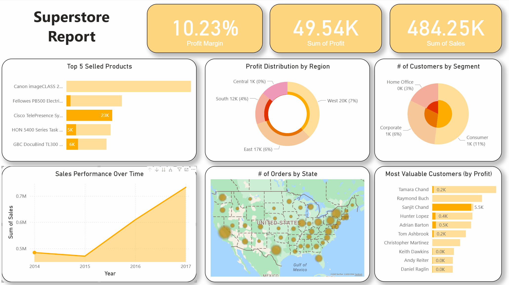

# Superstore Sales Analysis Report

## Overview
This Power BI report provides comprehensive analysis of a fictional superstore's sales data, offering insights into business performance across multiple dimensions including geography, product categories, customer segments, and time periods.

## Report Preview

## Data Source
- **Original Dataset**: [Superstore Dataset on Kaggle](https://www.kaggle.com/datasets/vivek468/superstore-dataset-final?resource=download)
- **File**: `Sample - Superstore.csv`
- **Records**: 9,994 transactions
- **Time Period**: 2014-2017
- **Geographic Coverage**: United States

## Dataset Structure
The dataset contains the following key fields:

### Order Information
- **Row ID**: Unique identifier for each record
- **Order ID**: Unique order identifier
- **Order Date**: Date when the order was placed
- **Ship Date**: Date when the order was shipped
- **Ship Mode**: Shipping method used

### Customer Information
- **Customer ID**: Unique customer identifier
- **Customer Name**: Customer's full name
- **Segment**: Customer segment (Consumer, Corporate, Home Office)

### Geographic Data
- **Country**: All orders from United States
- **City**: Customer's city
- **State**: Customer's state
- **Postal Code**: Customer's postal code
- **Region**: Geographic region (East, West, Central, South)

### Product Information
- **Product ID**: Unique product identifier
- **Category**: Main product category (Furniture, Office Supplies, Technology)
- **Sub-Category**: Detailed product sub-category
- **Product Name**: Full product name

### Financial Metrics
- **Sales**: Revenue generated from the transaction
- **Quantity**: Number of units sold
- **Discount**: Discount percentage applied
- **Profit**: Profit earned from the transaction

## Report Files
- **SuperstoreReport.pbix**: Main Power BI report file
- **SuperstoreRpoert.gif**: Animated preview showing the interactive dashboard and key visualizations
- **Sample - Superstore.csv**: Source data file (downloaded from Kaggle)

## Key Business Insights
This report enables analysis of:

### Sales Performance
- Total sales revenue trends over time
- Monthly and yearly sales patterns
- Performance by geographic regions

### Product Analysis
- Best and worst-performing product categories
- Sub-category performance comparison
- Product profitability analysis

### Customer Segmentation
- Sales distribution across customer segments
- Customer behavior patterns
- Geographic customer distribution

### Operational Metrics
- Shipping mode effectiveness
- Discount impact on profitability
- Regional performance variations

## How to Use
1. Open `SuperstoreReport.pbix` in Microsoft Power BI Desktop
2. The data is already connected to the local CSV file
3. Use the interactive filters and slicers to explore different dimensions
4. Hover over charts for detailed tooltips
5. Click on elements to cross-filter related visuals

## Technical Requirements
- Microsoft Power BI Desktop
- Windows Operating System
- Access to the local CSV data file

View the animated GIF above for a quick visual overview of the dashboard layout, interactive features, and key visualizations in action.

## Data Refresh
To update the report with new data:
1. Replace the CSV file with updated data (maintaining the same structure)
2. Open the Power BI file
3. Click "Refresh" in the Home ribbon
4. Save the updated report

---
*Report created as part of Power BI analytics portfolio demonstrating data visualization and business intelligence capabilities.*